# AIFlow - AI 驱动的代码行为沙盘

**一个革命性的代码分析与可视化平台，将静态代码结构与动态运行行为融合在一起**

---

## 🎯 项目愿景

AIFlow 不是一个简单的代码阅读工具，而是一个能够帮助开发者真正理解复杂软件系统如何在多个抽象层次上协同运作的**"行为沙盘"**。

### 核心使命

- **多层次理解**：在宏观架构和微观实现之间自由穿梭
- **行为可视化**：将静态代码转化为动态的、可交互的执行流程
- **智能语义化**：由 AI 负责模块划分、功能命名等需要语义理解的关键任务
- **嵌套式启动**：大模块的"大按钮"启动系统级联动，子模块的"小按钮"运行局部流程

---

## 🏗️ 设计哲学

### 1. 智能委托策略

平台本身**不进行代码解析**，而是扮演"指挥官"角色：

```
用户 → AIFlow 核心指令集 → AI 工具 → 标准化 JSON 输出 → 可视化前端
```

- **核心指令集（Prompt Library）**：精心设计的分阶段分析指令
- **AI 工具**：负责所有技术分析和语义理解工作
- **标准数据协议**：统一的 JSON Schema 定义所有分析结果

### 2. 技术栈无关性

作为**"无外壳"的 MCP 工具**，平台通过适配器接口实现与具体 AI 服务的解耦：

- ✅ Claude 4.5 Sonnet
- ✅ OpenAI GPT-4
- ✅ Google Gemini
- 🔄 任何支持 MCP 的 AI 编程助手

### 3. 层级与行为的统一

传统工具要么展示静态结构，要么展示运行流程，两者割裂。AIFlow 深度融合两者：

- **代码逻辑层次结构**本身是交互式的
- 每个具备独立业务意义的代码单元都配备**AI 命名的专属启动按钮**
- 用户可以在任意层级观察整体协同或深入局部细节

### 4. 嵌套式行为启动 🚀

这是 AIFlow 最独特的创新：

```
📦 System Module [大按钮：启动完整用户注册流程]
  ├─ 📂 Auth Module [小按钮：验证邮箱]
  │   ├─ 🔧 validateEmail() [微按钮：单步执行验证逻辑]
  │   └─ 🔧 sendVerificationCode()
  └─ 📂 Database Module [小按钮：保存用户数据]
      └─ 🔧 insertUser()
```

- **大按钮（Macro）**：系统级多流程联动场景
- **小按钮（Micro）**：子模块独立业务流程
- **微按钮（Function）**：单个函数执行轨迹

### 5. 并发行为的精确表达

现代软件系统充满并行、异步等并发模式。AIFlow 支持：

- **时序图**：生命线和消息流
- **流程图**：带 fork（分叉）和 join（汇合）节点
- **多流程联动动画**：在主结构图上同时播放多条执行轨迹
- **调用堆栈可视化**：递归调用的层层嵌套区块

### 6. 全方位的用户控制

用户不是被动的观察者：

- ⏯️ **播放/暂停/回溯**：控制任意层级行为
- 🔍 **单步运行详情**：检查变量状态和执行路径
- 📊 **多维度切换**：结构图 ↔ 时序图 ↔ 流程图
- 🎨 **语义可视化**：MVC 颜色标记、技术栈 Logo、数据库图标

---

## 📋 完整工作流程

### 五阶段智能分析流程

```mermaid
graph LR
    A[用户提供源代码] --> B[核心指令集]
    B --> C[AI 执行分析]
    C --> D[标准 JSON 输出]
    D --> E[可视化引擎]
    E --> F[交互式行为沙盘]
```



#### 第一阶段：连接与指挥
- 用户通过 **AI 适配器**将 AIFlow 连接到选定的 AI 工具
- 平台内置的**核心指令集**启动，分阶段向 AI 发送分析指令

#### 第二阶段：智能分析（AI 工具执行）
AI 对完整源代码进行深度分析，完成：
1. **项目认知**：理解项目类型、技术栈、架构模式
2. **结构识别**：划分模块、组件、函数并建立层次关系
3. **语义分析**：理解业务语义，生成自然语言的模块/函数命名
4. **执行推理**：推断核心业务场景的执行路径和调用关系
5. **并发检测**：识别异步、多线程、并发模式

最终输出：遵循**标准数据协议**的详尽 JSON 文件

#### 第三阶段：沙盘生成
**可视化引擎**接收 JSON 数据，渲染动态层级的代码结构图：

- 使用 **Cytoscape.js** 渲染可展开折叠的分组块
- 每个分组和组件上生成 **AI 命名的启动按钮**
- 使用特定颜色标记 MVC 模式、技术栈 Logo、数据库图标

#### 第四阶段：行为观察（用户交互）

**宏观视角**：
- 点击**大按钮**启动系统级动画
- 观看代表不同并发流程的"脉冲"在沙盘上同时流动
- 理解模块间的协同关系

**微观视角**：
- 展开分组，点击**小按钮**独立运行子模块流程
- 切换到时序图/流程图查看执行细节
- 进入**单步运行详情**检查变量状态

#### 第五阶段：深度探索

- **变量作用域追踪**：全局/局部/闭包作用域的变量快照
- **调用堆栈可视化**：递归调用的层层嵌套
- **并发同步点**：fork/join 节点和线程汇合点
- **时间轴估算**：基于 AI 推理的相对时间戳

---

## 🛠️ 技术架构

### 三层核心架构

```
┌─────────────────────────────────────────────┐
│  核心指令集层 (Prompt Library)              │
│  - 5阶段分析指令模板                        │
│  - Jinja2 模板引擎                          │
│  - 版本化管理                               │
└─────────────────────────────────────────────┘
                    ↓
┌─────────────────────────────────────────────┐
│  AI 适配器层 (Adapter SPI)                  │
│  - Claude 4.5 Adapter                       │
│  - OpenAI Adapter                           │
│  - Gemini Adapter                           │
└─────────────────────────────────────────────┘
                    ↓
┌─────────────────────────────────────────────┐
│  标准数据协议 (JSON Schema v1.0.0)          │
│  - 项目元数据                               │
│  - 代码结构（节点/边）                      │
│  - 启动按钮（嵌套层级）                     │
│  - 执行轨迹（多格式）                       │
│  - 并发信息                                 │
└─────────────────────────────────────────────┘
                    ↓
┌─────────────────────────────────────────────┐
│  可视化引擎层 (Visualization Engine)        │
│  - Cytoscape.js: 行为沙盘（主引擎）         │
│  - D3.js: 单步详情图表（辅助引擎）          │
│  - Monaco Editor: 代码高亮                  │
└─────────────────────────────────────────────┘
```

### 技术栈

#### 后端（Python 3.11+） - 无服务器架构
- **AI SDK**: Anthropic (Claude 4.5), OpenAI, Google Generative AI
- **模板引擎**: Jinja2
- **数据验证**: jsonschema, Pydantic
- **依赖管理**: Poetry

#### 前端（React 18 + TypeScript 5.x） - 纯静态应用
- **框架**: React 18 + TypeScript
- **状态管理**: Zustand
- **可视化**:
  - Cytoscape.js（代码结构图 + 多流程动画）
  - D3.js（时序图/流程图/变量追踪）
- **代码编辑器**: Monaco Editor
- **构建工具**: Vite

---

## 📂 项目结构

```
aiflow/
├── backend/                           # Python 后端（无服务器）
│   ├── aiflow/
│   │   ├── protocol/                  # 标准数据协议层
│   │   │   ├── validator.py          # JSON Schema 验证器
│   │   │   ├── serializer.py         # 序列化/反序列化引擎
│   │   │   ├── entities.py           # TypedDict 实体定义
│   │   │   └── schemas/              # JSON Schema 文件
│   │   │       └── analysis-schema-v1.0.0.json
│   │   │
│   │   ├── adapters/                  # AI 适配器层 (SPI)
│   │   │   ├── base.py               # 抽象基类接口
│   │   │   ├── claude.py             # Claude 4.5 适配器
│   │   │   ├── openai.py             # OpenAI 适配器
│   │   │   └── gemini.py             # Gemini 适配器
│   │   │
│   │   ├── prompts/                   # 核心指令集层
│   │   │   ├── manager.py            # Prompt 模板管理器
│   │   │   ├── renderer.py           # Jinja2 渲染引擎
│   │   │   └── validator.py          # 模板格式验证器
│   │   │
│   │   └── analysis/                  # 分析引擎（可选）
│   │       └── engine.py             # 5阶段分析编排器
│   │
│   ├── prompts/                       # Prompt 模板库
│   │   ├── registry.yaml              # 模板注册表
│   │   ├── comprehensive/             # 综合分析
│   │   │   └── analysis/
│   │   │       └── v1.0.0.yaml       # 单次全面分析模板
│   │   ├── project-understanding/     # 阶段1：项目认知
│   │   ├── structure-recognition/     # 阶段2：结构识别
│   │   ├── semantic-analysis/         # 阶段3：语义分析
│   │   ├── execution-inference/       # 阶段4：执行推理
│   │   └── concurrency-detection/     # 阶段5：并发检测
│   │
│   ├── pyproject.toml                 # Poetry 配置
│   └── requirements.txt               # Pip 依赖列表
│
├── frontend/                          # React 前端（纯静态）
│   ├── src/
│   │   ├── types/
│   │   │   └── protocol.ts           # TypeScript 类型定义
│   │   │
│   │   ├── components/               # React 组件
│   │   │   ├── CodeStructureGraph/   # Cytoscape.js 结构图
│   │   │   ├── ExecutionTrace/       # D3.js 执行轨迹
│   │   │   ├── LaunchButton/         # 嵌套启动按钮
│   │   │   └── StepDetails/          # Monaco 单步详情
│   │   │
│   │   ├── stores/                   # Zustand 状态管理
│   │   │   ├── analysisStore.ts      # 分析数据状态
│   │   │   └── visualizationStore.ts # 可视化控制状态
│   │   │
│   │   └── utils/
│   │       ├── dataLoader.ts         # JSON 数据加载器
│   │       └── validators.ts         # 前端数据验证
│   │
│   ├── package.json
│   └── tsconfig.json
│
├── docs/                              # 文档
│   ├── ARCHITECTURE.md               # 架构设计详解
│   ├── PROMPT_DESIGN.md              # 核心指令集设计
│   ├── DATA_PROTOCOL.md              # 标准数据协议规范
│   └── USER_GUIDE.md                 # 用户使用指南
│
└── README.md                          # 本文件
```

---

## 🚀 快速开始

### 1. 安装依赖

**后端（Python）**：
```bash
cd backend
poetry install
# 或使用 pip
pip install -r requirements.txt
```

**前端（Node.js）**：
```bash
cd frontend
npm install
```

### 2. 配置 AI 适配器

创建 `.env` 文件配置 API Key：

```bash
# Claude 4.5
ANTHROPIC_API_KEY=your_anthropic_api_key

# OpenAI (可选)
OPENAI_API_KEY=your_openai_api_key

# Gemini (可选)
GOOGLE_API_KEY=your_google_api_key
```

### 3. 使用核心指令集分析项目

**方式 A：直接使用 Prompt 模板**

```python
from aiflow.prompts import PromptRenderer
from aiflow.adapters.claude import create_claude_adapter
import json

# 1. 加载 Prompt 模板
renderer = PromptRenderer()
prompt = renderer.render(
    language="python",
    stage="comprehensive_analysis",
    input_data={
        "project_path": "/path/to/your/project",
        "project_name": "MyApp",
        "source_files": ["main.py", "models.py", "..."]
    }
)

# 2. 通过 AI 适配器执行分析
adapter = await create_claude_adapter(model_name="claude-sonnet-4-5-20250929")
response = await adapter.generate(prompt=prompt)

# 3. 保存 JSON 结果
with open("analysis_result.json", "w") as f:
    json.dump(response.content, f, indent=2)
```

**方式 B：使用分析引擎（可选）**

```python
from aiflow.analysis import AnalysisEngine

engine = AnalysisEngine(adapter_type="claude")
result = await engine.analyze_project(
    project_path="/path/to/your/project",
    output_path="analysis_result.json"
)
```

### 4. 启动可视化前端

```bash
cd frontend
npm run dev
```

在浏览器中打开 `http://localhost:5173`，加载生成的 `analysis_result.json` 文件。

---

## 📊 标准数据协议

AIFlow 定义了完整的 JSON Schema v1.0.0，包含：

### 核心数据结构

```json
{
  "$schema": "https://aiflow.dev/schemas/analysis-v1.0.0.json",
  "version": "1.0.0",
  "project_metadata": {
    "name": "项目名称",
    "language": "python",
    "framework": "Django",
    "entry_points": ["main.py"]
  },
  "code_structure": {
    "nodes": [
      {
        "id": "uuid-v4",
        "label": "用户认证模块",
        "stereotype": "module",
        "parent": null
      }
    ],
    "edges": [
      {
        "id": "uuid-v4",
        "source": "node-id-1",
        "target": "node-id-2",
        "relationship": "imports"
      }
    ]
  },
  "behavior_metadata": {
    "launch_buttons": [
      {
        "id": "uuid-v4",
        "node_id": "关联节点ID",
        "name": "启动用户注册流程",
        "type": "macro",
        "level": "system",
        "parent_button_id": null,
        "child_button_ids": ["子按钮ID"],
        "traceable_unit_id": "执行轨迹ID"
      }
    ]
  },
  "execution_trace": {
    "traceable_units": [
      {
        "id": "uuid-v4",
        "name": "用户注册流程",
        "type": "i-trace",
        "sub_unit_ids": ["子单元ID"],
        "traces": [
          {
            "format": "flowchart",
            "data": {
              "steps": [...],
              "connections": [...]
            }
          },
          {
            "format": "sequence",
            "data": {
              "lifelines": [...],
              "messages": [...]
            }
          },
          {
            "format": "step-by-step",
            "data": {
              "steps": [...],
              "variableScopes": [...],
              "callStack": [...]
            }
          }
        ]
      }
    ]
  },
  "concurrency_info": {
    "mechanisms": ["asyncio", "threading"],
    "sync_points": [...]
  }
}
```

详细规范参见 `docs/DATA_PROTOCOL.md`

---

## 🎨 核心功能展示

### 1. 嵌套启动按钮

```
[🚀 启动完整电商订单流程]  ← 系统级大按钮
  ├─ [📦 商品选择模块]
  │   ├─ [🔍 搜索商品]      ← 子模块小按钮
  │   └─ [➕ 加入购物车]
  ├─ [💳 支付模块]
  │   ├─ [🔐 验证支付密码]
  │   └─ [💰 扣款处理]
  └─ [📮 物流模块]
      └─ [📍 创建配送任务]
```

### 2. 多流程联动动画

在主结构图上同时播放多条执行轨迹：
- **蓝色脉冲**：主线程执行路径
- **绿色脉冲**：异步任务执行路径
- **红色脉冲**：错误处理路径

### 3. 单步运行详情

```
执行步骤 #42 | 2025-10-12T14:30:05.123Z
文件: src/auth/login.py:87
代码: user = await db.get_user(email)

变量作用域:
  ┌─ Global Scope
  │  └─ db: DatabaseConnection
  ├─ Local Scope (login_handler)
  │  ├─ email: "user@example.com"
  │  └─ password: "******"
  └─ Closure Scope
     └─ session_id: "abc123"

调用堆栈:
  1. main() [main.py:12]
  2. handle_request() [server.py:45]
  3. login_handler() [auth/login.py:23]
  4. → await db.get_user() [auth/login.py:87]
```

---

## 📖 实施路线图

### Step 1: 标准数据协议 ✅
- [x] 定义完整的 JSON Schema v1.0.0
- [x] 实现 Python TypedDict 实体
- [x] 实现 TypeScript 类型定义
- [x] 创建数据验证器和序列化器

### Step 2: 核心指令集 ✅
- [x] 设计 5 阶段分析 Prompt 模板
- [x] 实现 Jinja2 模板管理器
- [x] 创建综合分析 Prompt（v1.0.0）
- [ ] 优化各语言特定的 Prompt 模板

### Step 3: AI 适配器接口 ✅
- [x] 定义 SPI 抽象基类
- [x] 实现 Claude 4.5 适配器
- [ ] 实现 OpenAI 适配器
- [ ] 实现 Gemini 适配器

### Step 4: 可视化引擎 🚧
- [ ] Cytoscape.js 代码结构图
- [ ] 嵌套启动按钮组件
- [ ] 多流程联动动画
- [ ] D3.js 时序图/流程图
- [ ] Monaco Editor 单步详情

### Step 5: 用户体验优化 📋
- [ ] 渐进式信息披露
- [ ] 上下文提示和引导
- [ ] 性能优化（虚拟化渲染）
- [ ] 响应式设计

---

## 🤝 贡献指南

欢迎贡献！特别是：

1. **AI 适配器开发**：为更多 AI 工具编写适配器
2. **Prompt 模板优化**：改进分析指令的准确性和效率
3. **可视化增强**：提供更丰富的交互和展示方式
4. **语言支持**：扩展对更多编程语言的分析支持

详见 `CONTRIBUTING.md`

---

## ⚠️ 已知挑战

### 1. AI 输出的不确定性
- **挑战**：AI 分析结果可能不稳定或不准确
- **应对**：设计健壮的指令集，通过适配器做错误处理和降级

### 2. 数据协议的演进
- **挑战**：在规范化和灵活性之间找到平衡
- **应对**：预留扩展机制，采用语义化版本管理

### 3. 性能优化压力
- **挑战**：层级交互 + 多流程动画对浏览器性能要求高
- **应对**：虚拟化渲染、增量更新、Web Worker

### 4. 交互复杂度管理
- **挑战**：功能强大往往伴随交互复杂
- **应对**：渐进式披露、上下文提示、优秀的 UI/UX 设计

### 5. 适配器生态维护
- **挑战**：外部 AI 服务 API 可能频繁变更
- **应对**：适配器版本管理机制，鼓励社区贡献

---

## 📄 许可证

MIT License

---

## 🙏 致谢

- **Cytoscape.js** - 强大的图形可视化库
- **D3.js** - 数据驱动的文档操作
- **Monaco Editor** - VS Code 级别的代码编辑器
- **Anthropic Claude** - 强大的 AI 分析能力

---

## 📮 联系方式

- **Issues**: [GitHub Issues](https://github.com/yourusername/aiflow/issues)
- **Discussions**: [GitHub Discussions](https://github.com/yourusername/aiflow/discussions)
- **Email**: your.email@example.com

---

**AIFlow - 让代码行为像沙盘一样清晰可见** 🚀
